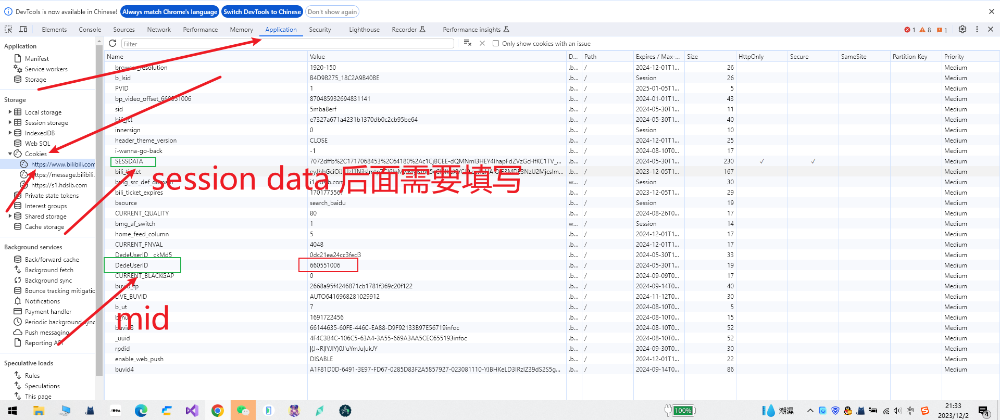

#哔哩哔哩动画看板APP 
## 介绍
该APP是由大学生所编写的一款简单的APP 它是基于Android Compose响应式编程方式实现的一款APP

## APP功能
+ 可以查看当前用户的粉丝列表 已经他们的视频列表 如果该用户不允许查看 这就是现实暂无视频信息
+ 可以获取当前用户的消息 在通知面板中,及时获取
+ 可以获取用户自己的个人中心的公告信息
+ 支出退出APP功能

## 如何登录APP
+ 需要你的MID 和 SESSDATA 如何获取？
  打开游览器 前提是你已经登录账号 然后按F12 打开控制台 具体如下：
  

